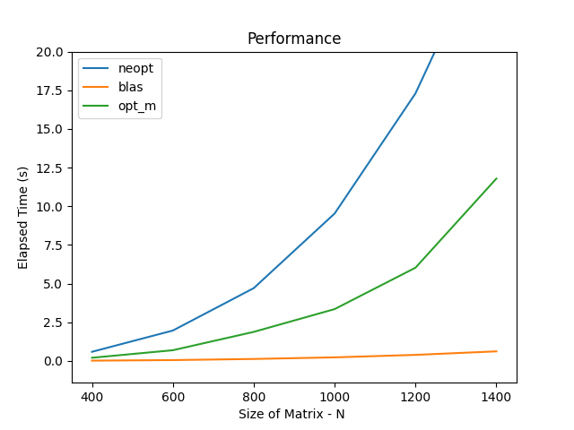

Anton Stefan,
331CC

Tema3 - Optimizarea inmultirii matricilor

Durata implementare:
~9 ore

Detalii implementare:

Implementam operatia C = (At x B + B x A) x Bt in 3 moduri si comparam performantele.

blas
Cea mai buna metoda ca timpi, surprinzator de rapida. Implementarea se bazeaza pe optimizarile 
avansate pe care biblioteca BLAS le face la nivelul functiilor sale.
Am alocat memoria necesara pentru matricele C, temp1 si temp2 pentru rezultatele intermediare.
Am calculat traspusele At si Bt, dupa am multiplicat At cu B folosind cblas_dtrmm() care
realizeaza inmultirea unei matrici triunghiulare cu alta matrice, si am adunat
rezultatul in temp1. Aceasta functie profita de faptul ca A este o matrice superior triunghiulara
superioara prin CblasUpper efectuand optimizari specifice. 
Multiplicam B cu A folosind cblas_dtrmm() pentru a calcula temp2.
Adunam rezultatele intermediare temp1 si temp2 in C folosind cblas_daxpy() care efectueaza operatia
de adunare pe vectori liniari.
Multiplicam rezultatul folosind cblas_dgemm() care e in general folosita pentru inmultirea a doua
matrici dense, pentru a calcula C = C * Bt.

Run=./tema3_blas: N=400: Time=0.019774
Run=./tema3_blas: N=600: Time=0.056216
Run=./tema3_blas: N=800: Time=0.128685
Run=./tema3_blas: N=1000: Time=0.232801
Run=./tema3_blas: N=1200: Time=0.393193
Run=./tema3_blas: N=1400: Time=0.620085

neopt
Varianta neoptimizata, intr-un mod direct.
Alocam memoria necesara pentru matricele C, temp1, temp2 si temp3 pentru rezultatele intermediare.
Calculam transpusa At si Bt.
Multiplicam At cu B si adunam rezultatul in temp1.
Multiplicam B cu A si adunam rezultatul in temp2.
Adunam temp1 si temp2 in temp3.
Multiplicam temp3 cu Bt si obtinem rezultatul final in C.

Run=./tema3_neopt: N=400: Time=0.591258
Run=./tema3_neopt: N=600: Time=1.966657
Run=./tema3_neopt: N=800: Time=4.707525
Run=./tema3_neopt: N=1000: Time=9.529467
Run=./tema3_neopt: N=1200: Time=17.300417
Run=./tema3_neopt: N=1400: Time=28.533903

opt_m
In aceasta implementare optimizam buclele fata de cea neoptimizata, permitand compilatorului sa stocheze
variabilele in registrul CPU, fata de memorie, ceea ce accelereaza accesul si executia.
Am alocat memoria necesara pentru matricele C, temp1, temp2 si matricele
intermediare At si Bt.
Am calculat traspusele At si Bt.
Multiplicam At cu B si adunam rezultatul in temp1, folosind registrii.
Multiplicam B cu A si adunam rezultatul in temp2, folosind registrii.
Adunam temp1 si temp2 in C.
Multiplicam rezultatul folosind registrii pentru a calcula C * Bt, stocand
rezultatul final in temp1.
Copiem rezultatul din temp1 in C.

Run=./tema3_opt_m: N=400: Time=0.206836
Run=./tema3_opt_m: N=600: Time=0.693797
Run=./tema3_opt_m: N=800: Time=1.879293
Run=./tema3_opt_m: N=1000: Time=3.351983
Run=./tema3_opt_m: N=1200: Time=6.029153
Run=./tema3_opt_m: N=1400: Time=11.790363

Am folosit valgrind pentru a asigura ca nu exista memory leaks, si am salvat iesirile in folderul memory.
valgrind --tool=memcheck --leak-check=full --log-file=blas.memory ./tema3_blas ../input/input_valgrind
valgrind --tool=memcheck --leak-check=full --log-file=neopt.memory ./tema3_neopt ../input/input_valgrind
valgrind --tool=memcheck --leak-check=full --log-file=opt_m.memory ./tema3_opt_m ../input/input_valgrind

Vedem ca nu exista leakuri.

Am folosit cachegrind pentru a analiza accesul la cache si am salvat iesirile in folderul cache.
valgrind --tool=cachegrind --branch-sim=yes --cache-sim=yes --log-file=blas.cache ./tema3_blas ../input/input_valgrind
valgrind --tool=cachegrind --branch-sim=yes --cache-sim=yes --log-file=neopt.cache ./tema3_neopt ../input/input_valgrind
valgrind --tool=cachegrind --branch-sim=yes --cache-sim=yes --log-file=opt_m.cache ./tema3_opt_m ../input/input_valgrind

I refs reprezinta numarul de referinte de instructiuni executate de procesor care sunt aduse din memorie sau cache.
Implementarile blas si opt_m au mai putine referinte la instructiuni decat neopt, indicand o eficienta mai mare
in executarea codului.

I1 Misses si LLi Misses sunt rata de esecuri la nivelul cache-ului L1 si L2. Toate implementarile au rata foarte mica,
indicand un acces eficient la cacheul de instructiuni.

D refs reprezinta numarul de referinte la date, fiecare citire sau scriere. Neopt are un numar semnificativ mai mare
comparativ cu cele 2, sugerand ca este mai putin eficienta in accesarea si manipularea datelor.

Branches reprezinta numarul de ramificari executate. Blas si opt_m au un numar mai mic fata de neopt, indicand un control
mai bun al fluxului.

Mispredicts eficienta predictiilor de ramificare. Blas are cea mai eficienta rata.

De asemenea in runtimes.json am salvat timpii de executie pentru fiecare implementare, pe fiecare set de date.
Si am generat performance_graph.png pentru a vizualiza comparatia timpiilor de executie folosind graphics.py.
In input_extended avem valorile adaugate pe care s-au realizat testele.

Comparatii:

Analizand graficele create de scriptul de mai sus, precum si timpii mentionati.
Pentru 400 <= N <= 1400

    'opt_m' este, in medie cu 82.64% mai rapid decat 'neopt'
    'blas' este, in medie cu 79,08% mai rapid decat 'opt_m'

Graficul meotdei 'blas' este aproape o dreapta), indicand o scalare foarte buna si performante stabile, sublinind
importanta utilizarii bibliotecilor optimizate, cum ar fi BLAS.

Concluzii:

Consider ca tema este una utila care te invata despre posibile optimizari si iti arata cat de mare impact poate sa
aiba o solutie aleasa fata de alta prin grafice si comparatii. 